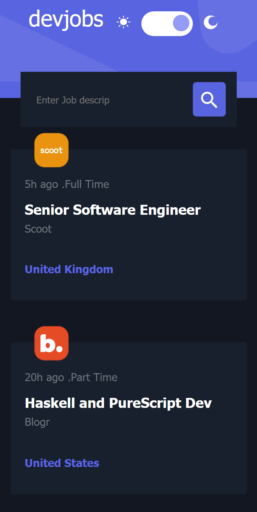

# Frontend Mentor - Devjobs web app solution

This is a solution to the [Devjobs web app challenge on Frontend Mentor](https://www.frontendmentor.io/challenges/devjobs-web-app-HuvC_LP4l). Frontend Mentor challenges help you improve your coding skills by building realistic projects.

## Table of contents

- [Overview](#overview)
  - [The challenge](#the-challenge)
  - [Screenshot](#screenshot)
  - [Links](#links)
- [My process](#my-process)
  - [Built with](#built-with)
  - [What I learned](#what-i-learned)
  - [Continued development](#continued-development)
  - [Useful resources](#useful-resources)
- [Author](#author)
- [Acknowledgments](#acknowledgments)

**Note: Delete this note and update the table of contents based on what sections you keep.**

## Overview

### The challenge

Users should be able to:

- View the optimal layout for each page depending on their device's screen size
- See hover states for all interactive elements throughout the site
- Be able to filter jobs on the index page by title, location, and whether a job is for a full-time position
- Be able to click a job from the index page so that they can read more information and apply for the job
- **Bonus**: Have the correct color scheme chosen for them based on their computer preferences. _Hint_: Research `prefers-color-scheme` in CSS.

### Screenshot

### Links

- Solution URL: [Add solution URL here](https://your-solution-url.com)
- Live Site URL: [https://mern-crud-job-portal-main.herokuapp.com/]

### Built with

- Flexbox
- CSS Grid
- Bootstrap
- [React](https://reactjs.org/) - JS library
- [Node.js](https://nodejs.org/) - React framework
- [Styled Components](https://styled-components.com/) - For styles

### What I learned

This was my first shot at a MERN app and I learnt quite a lot.
I learnt how to use: 
- MongoDB Atlas for database hosting
- nodejs for backend server
- mongoose to connect
- heroku to host the app
- client-side multiple search filtering system 

### Continued development

Would like to understand backend better as I faced some challenges in that regard especially trying to understand advanced search filtering system.

### Useful resources

- [resource for Navigation](https://stackabuse.com/programmatically-navigate-using-react-router/) - This helped me to navigate between pageswithout using 'Link to'.

## Author

- Frontend Mentor - [@faruking](https://www.frontendmentor.io/profile/faruking)
- Twitter - [@faruking2](https://www.twitter.com/faruking2)